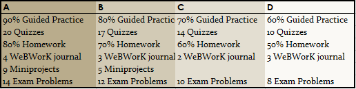
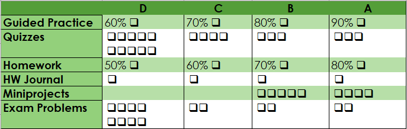

## Contact Information
__Instructor:__ Serge Ballif  
__Email:__ Please use the Piazza discussion board in the left panel of Canvas.  
__Telephone:__ (702) 992-2613  
__Office Hours:__ NSE 114 Mon/Wed/Fri 8:45-9:20, Tue/Thu 2:30-3:30 Drop by my office any time for help.

## Course Learning Outcomes
A successful Math 182 student will demonstrate evidence of mastery of each of the following learning  outcomes:

1. Integrals by Substitution
    * Identify problems where substitution would be an appropriate technique.
    * Carry out the $u$-substitution.
    * Use substitution for both definite and indefinite integrals.

2. Integration by Parts
    * Identify problems where integration by parts would be an appropriate technique.
    * Carry out integration by parts using neatly organized work.
    * Use integration by parts for both definite and indefinite integrals.

3. Partial Fraction Decomposition and Other Techniques
    * Use partial fractions to rewrite expressions as a sum of more fundamental terms.
    * Use partial fractions to evaluate both definite and indefinite integrals.
    * Recognize and implement appropriate techniques to anti-differentiate products of  trigonometric functions.

4. Numerical Integration
   * Use left, right, and midpoint Riemann sums to estimate the values of a definite integral.
   * Use the trapezoid rule to estimate the area under a curve.
   * Use Simpson's rule to estimate the area under a curve.

5. Find the area of a region bounded between curves.
   * Set up integrals that yield the area of a bounded region.
   * Know when to integrate with respect to $x$ or with respect to $y$.

6. Length of a Curve
   * Express the length of a curve as a Riemann sum of linear segments.
   * Find the length of a curve using a definite integral.

7. Use Integrals to find Volume
   * Use the method of cylindrical shells to find the volume of a surface of revolution.
   * Use the disc method to find the volume of a surface of revolution.
   * Recognize whether to set up the integrals with respect to $x$ or $y$.

8. Physics Applications
   * Find the mass and center of mass of a region with a given density.
   * Calculate the amount of work accomplished by a force.

9. Improper Integrals
    * Explain what it means for an improper integral to converge.
    * Determine convergence of improper integrals with discontinuities in their domain or  infinite limits of integration
    * Evaluate improper integrals.

10. Parametric Curves
    * Represent a function a function as parametric equations.
    * Find the length of a curve segment from its parametric form.
    * Find the slope of a parametric curve at a given point.

11. Polar Curves
    * Convert between polar coordinates to Cartesian coordinates and plot basic graphs.
    * Find the slope of a polar curve at a given point.
    * Find the area enclosed by a polar curve.

12. Differential Equations
    * Use the a slope field to obtain qualitative information about solutions to a differential equation.
    * Use Euler's method to approximate the solution to an intial value problem.
    * Solve Separable differential equations.

13. Modeling with Differential Equations
    * Set up an initial value problem to model a changing quantity.
    * Use exponential and logistic models to model population growth.

14. Sequences of numbers
    * Know what it means for a sequence to converge or diverge.
    * Use the concept of the limit at infinity to determine whether a sequence of real numbers  is bounded and whether it converges or diverges

15. Series of numbers
    * Evaluate the exact value of a geometric series.
    * Apply tests of convergence to identify whether a given series converges or diverges.

16. Taylor Series
    * Find a Taylor polynomial that approximates a given function.
    * Find a power series expansion of a function.
    * Identify intervals of convergence for a power series.

## Quick Grade Summary
The table below describes the minimum requirement to attain each grade level. The [Schedule](NSC-Math-182/index.html) tells when outside work is due and the [Specifications](NSC-Math-182/Specifications.html) give the details on how to earn a __PASS__.

The rest of the syllabus explains more details about what these categories are.

## Course Materials
__Textbook:__ _Active Calculus_ by Matt Boelkins et al. This is a free PDF download at
[http://gvsu.edu/s/xr](http://gvsu.edu/s/xr) or on the web at http://gvsu.edu/s/0uo. If you would like a print copy, see the link at the bottom of that page. We will be working through Sections 5.3--8.6 of this textbook (and adding two additional topics).
__Video materials:__ All course pre-lectures are on a YouTube playlist at [http://bit.ly/GVSUCalculus](http://bit.ly/GVSUCalculus).
__Software:__ The course uses three software tools:

* [Canvas](http://nsc.instructure.com) is the course management system where our course home page is hosted.
* [Desmos](https//desmos.com) , a free program for graphing functions and building models. Guided Practice assignments will be completed using Desmos.
* WeBWorK is our online homework system. WeBWorK can be accessed using the link in the left-hand menu of our Canvas course.

## Assigned Work
The work you do in the course has two purposes: To help you make sense of the concepts you are supposed to know, and to assess how well you have mastered the learning objectives of the course. These items of work include:

* __Guided Practice:__ These are structured activities that guide you (by questions that you answer) through reading, viewing, and other preparatory activities on new content.
* __WeBWorK Homework:__ For each section there will be about a dozen homework problems to complete using WeBWorK.  These exercises focus on computational skill and basic conceptual  understanding and build upon your first contact with Calculus material you gain
through Guided Practice.
* __WeBWorK Journal:__ Students will record their work on WeBWorK homework problems following the specification guidelines.
* __Daily Quizzes:__ At the beginning of each class period where we begin lecture on a new section we will have a quiz to assess how well you have mastered the material of the previous day.
* __Problems:__ The objectives of the course can be broken down into 17 distinct types of problems. Samples of these 16 types are posted to the Blackboard site. Within these 16 types. These problems are more complex and challenging than those found on Guided Practice, Online Homework, or Concept Quizzes and include elements of each of these. Your ability to solve these problems will be assessed through three Midterm Exams and a Final Exam, described more fully below.
* __Miniprojects:__  In addition to the Problems, eleven miniprojects that involve using course technology are available, with 4 of those 8 labelled as core and 4 more outside the core. Miniprojects focus on realworld applications and the use of realworld data and, especially, the use of technology to model and solve problems involving calculus.

__Grading System__
Math 182 uses a **points-free mastery-based grading system** that is designed to provide you with control over the grading process, transparency as to your progress toward a course grade, and a final course grade that truly reflects your actual mastery of course concepts. Our grading system works as follows:

* At the beginning of the semester, you will be asked to decide on the target grade you plan to earn for the course. This does not need to be an “A”. You’ll be asked to carefully consider your goals, skill set, life situation, academic needs, and so on before stating your target grade. For some students, a “B” or even a “C” is perfectly sufficient and realistic, relative to their situation.
* **The means of assessing your graded work in the class is done without using points**. Instead, your work is graded on a two-level scale of **Pass/No Pass** or on a three level scale of **Mastery/Progressing/Novice**. Whenever you submit work to be graded, I will employ my best professional judgment along with a clear list of specifications for categorizing that work. The specifications for your work are provided in a separate document, and you should make yourself intimately familiar with that document. Your Guided Practice, WeBWorK Homework, WeBWorK Journals, and Daily Quizzes are graded on a Pass/No Pass basis; Problems, Miniprojects, and Teaching Items are graded using Mastery/Progressing/Novice designations.
* The grade you earn at the end of the semester is determined by counting the number of items in each category that you complete at an acceptable level . There are no points involved and no statistical or numerical calculations.

The table for determining your grade is given below. For reference: there are a total of 24 problems and miniprojects, 10 of which are considered core and 14 of which are outside the core. Also, there will be 27 daily quizzes, 27 guided practice assignments, and 220 points of online homework. See the [Specifications for Student Work](NSC-Math-182/Specifications.html) page to see what it means to obtain a __Pass__ or a __Mastery__.

The table below shows the minimum requirement to attain

__Plus/Minus grading:__ In case not all of your attainments in the class are at the same grade level, we will figure plus/minus grades as follows. Note there are seven overall categories of work you will do: Getting Started, Guided Practice, Leading Discussions, Concept Checks, CORE-M Assessments, Mastery Problems, and Teaching Items.  First, find your category at which you have attained the lowest level of work. If that is the only category at this level, you will receive a “minus” grade for the next level up. If there are two categories at the lowest level you will receive a “plus” grade. Otherwise (more than two categories at that lowest level) you will receive the grade of your lowest level.

Please note that NSC does not award grades of A+ or D-.

__Revisions:__ Instead of partial credit, you will receive numerous opportunities to revise and resubmit work that does not meet the specifications for Passing or Mastery. Specifically:

* Online homework gives instant feedback on correctness when you submit it. **You are allowed unlimited reattempts on every online homework item** until the due date.
* **Each Daily Quiz can be attempted twice without penalty** (an initial attempt + one reattempt in my office). Further reattempts can be “purchased” using tokens (see below).
* Problems are assessed on Midterm and Final exams. Each of the Midterm Exams past the first one as well as the Final Exam is cumulative . The first midterm exam will have four problems on it, the second one eight problems, the third around twelve, and the fourth midterm and final will include all 17 problems. **In this way if you do not perform well on a problem on one midterm exam, you can try again on a subsequent one.** Conversely, once you finish enough problems at Mastery level for the grade you want, you can opt out of the exams. It’s not uncommon for many students not to take the final exam because they have already “leveled up” to their target grade by the time of the exam.
* **Any miniproject submission that does not attain Mastery level can be revised and resubmitted for regrading.** You can submit up to one miniproject per week for regrading (in addition to any new submissions). Miniprojects that attain Progressing level can be resubmitted without penalty. Miniprojects assessed at Novice level can be resubmitted if you spend a token (below).
*
_Note_: Guided Practice assignments may not be revised or submitted late. These must be completed at the stated deadline or they receive a permanent No Pass.

__Tokens:__ Each student will be given five “tokens” at the beginning of the term. Each token can be cashed in for one of the following:  

* A revision of a Miniproject that was assessed at Novice level (within one week of receiving the grade).
* A revision of a WeBWorK journal (within one week of receiving the grade)
* A third attempt of a Quiz (any time during the semester though the second attempt must be within a week of taking the first quiz).
* A 24-hour extension on any Midterm Exam, Miniproject, WeBWorK set, or Teaching Item, or the Getting Started assignment. If you choose to use a token for a deadline extension, you must inform me prior to the original deadline. Submissions given after the extended deadline are not accepted.  

Opportunities to earn additional tokens may be given during the semester.

__Notes about this grading system:__ The advantages of this grading system are numerous:

* It focuses course work away from point-scoring, which is counterproductive to learning, and focuses instead on whether or not your work meets professional quality standards.
* It places control of your grade firmly in your hands so that you don’t have to “hope” for a grade.
* It directly links the grade you earn to the amount and quality of work that you do.
* It gives a final grade that communicates real information about your mastery of the subject.
* Finally, it allows you to be graded on what you eventually master, so that early missteps do not have to have a major negative future impact.

The chief downside to this system is that it’s complicated. You can download my [sample gradebook](assets/images/Math182Gradebook.xlsx) to track your progress through the course to help make it easier. And if you have any questions or concerns about the system, please let me know.

## What are the consequences of missing class?

If you miss class you will miss out on the daily quiz. The quiz will only be given to students in class; you will need to use one of your tokens if you want to take a quiz outside of class. If you miss class, then you will also miss out on the lecture and activities. One possible way to catch up on the material that was covered during class is to watch the lecture recording which can be accessed by clicking on the mediasite tab in Canvas. However, you should only think of the recorded lecture as a backup because there are occasionally technical problems.

Note that the style of this class is a partially flipped class, so you will do much of your learning by reading and watching videos outside of class. Much of each class period will be devoted to applying the principles and practicing the techniques that will be acquired in the out-of-class reading. You probably don’t want to miss out on the classroom discussion and activities. If you must miss class, then be sure to complete the Guided Practice prior to class.
